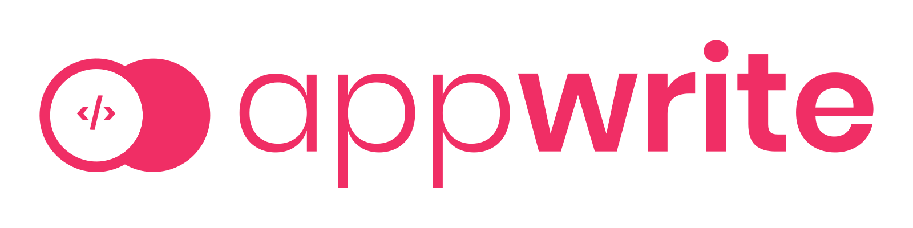

# 🔖 Instagram clone by using NextJS and Appwrite server



## Screenshot


## 🎬 Getting Started!

### 🤘 Install Appwrite 
Follow our simple [Installation Guide](https://appwrite.io/docs/installation) to get Appwrite up and running in no time. You can either deploy Appwrite on your local machine or, on any cloud provider of your choice. 

> Note: If you setup Appwrite on your local machine, you will need to create a public IP so that your hosted frontend can access it.


### 🚀 Deploy the Front End
You have two options to deploy the front-end and we will cover both of them here. In either case, you will need to fill in these environment variables that help your frontend connect to Appwrite.

* REACT_APP_ENDPOINT - Your Appwrite endpoint
* REACT_APP_PROJECT - Your Appwrite project ID
* REACT_APP_COLLECTION_ID - Your Appwrite collection ID 


### **Run locally**

Follow these instructions to run the demo app locally

```sh
$ git clone https://github.com/Sooraj-s-98/appwrite-instagram-clone
$ cd appwrite-instagram-clone
```


Now fill your environment variables


Now run the following commands and you should be good to go 💪🏼

```
$ npm install
$ npm run dev
```


## Thanks

Glad to see here! Show some love by [starring](https://github.com/Sooraj-s-98/appwrite-instagram-clone/) this repository. 

